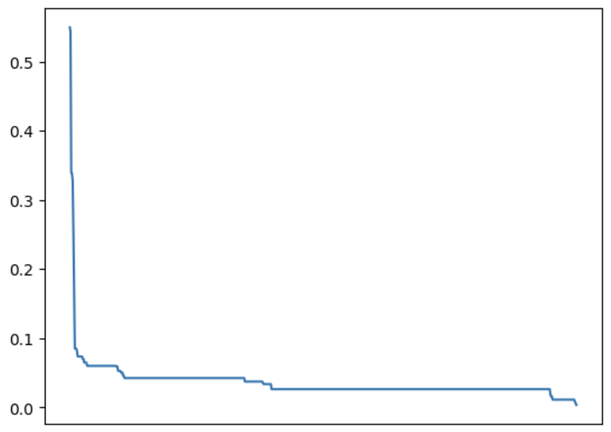

# Titanic Challenge Logistic Regression Submission

This is my personal answer for the [kaggle titanic challenge](https://www.kaggle.com/c/titanic).

In this solution I opted for a simple logistic Regression after the following series of preprocessing stages:

- Remove 'PassengerId', and 'Cabin' Columns
- Impute 'Embarked', 'Age', and 'Fare' Columns
- Extract title from the 'Name' Column into a new 'Title' column, like for example Mr. and Miss.
- Hot encode the 'Ticket', 'Sex', 'Embarked', and 'Title'.
- Normalize all data between 0 and 1

Due to the hot encoding stage, the train dataset ended up with 704 columns. Fow which most of them didn't really had a significative correlation with the 'Survived' column. In the next graph it's shown the correlations from all the columns against the 'Survived' Column.

I thought by removing the least correlated columns the model may over fit less. However empirically the best score in the challenge was obtained when using the 704 columns.

# Results

After this approach I was able to obtain a score of 0.78229.

It's worth noting that long time ago I tried a approach using a deep neural network. The preprocessing stages where considerably less complex, for example, the only hot encoding was the 'Gender' column, and even so, the score obtain then was 0.79425. This may indicate that a non linear model is best suited for this problem.
